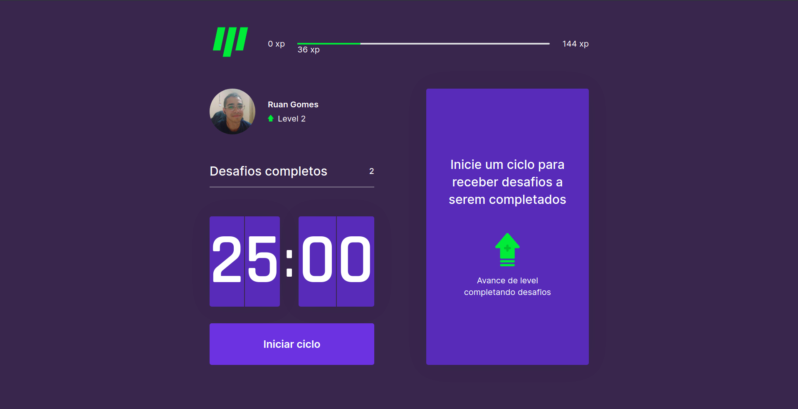

# Move.it

This project was done during RocketSeat's NextLevelWeek 4. Its goal is to encourage people who work at the computer all day to stretch using the pomodoro technique and gamification concepts.

In this project Next.js was used, taking advantage of the concepts of SSR (Server Side Rendering) and SSG (Static Side Generation), provided by Next and React.

## Install

It is necessary to hav yarn installed.

For instalation, use the command:
> yarn add next
> yarn build

## Run

Running this application is simple, using the **yarn dev** command at the root of the project.

You will see that it is running at localhost:3000.
